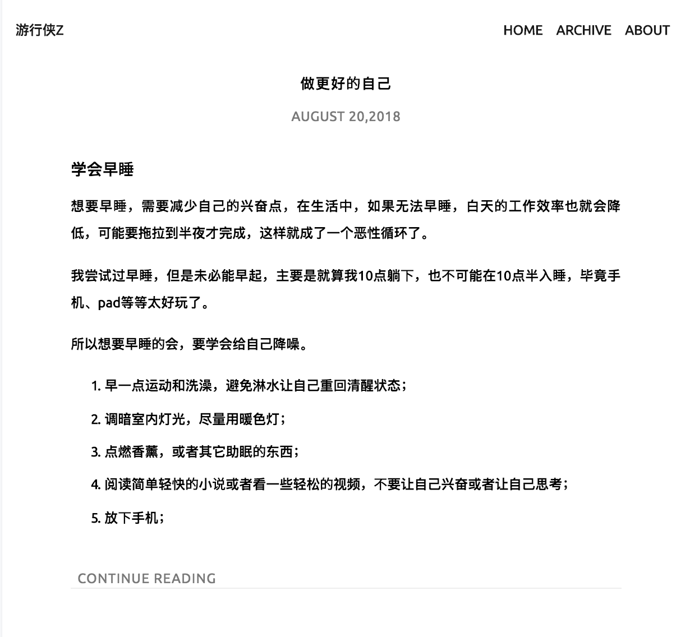
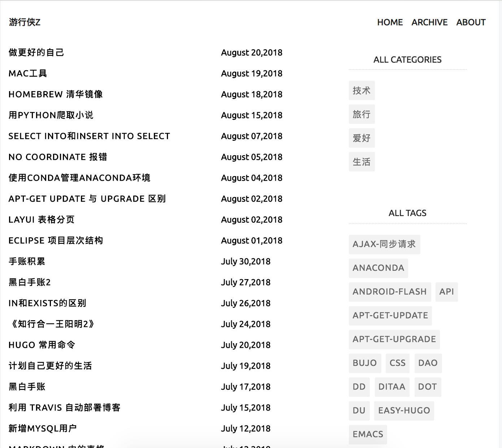

# hugo theme paladin

## 简介

主题参照了[hugo-theme-hiruko](https://github.com/GenkunAbe/hugo-theme-hiruko)的样式，去掉了一些用不到的功能。

主要使用了[bootstrap4](https://getbootstrap.com)，其中的一些内容来源自[阿里巴巴的矢量库](http://www.iconfont.cn)，用起来方便快捷。

增加了 valine 的使用方案，但是因为需要注册，默认不开启。

## 截图





## 使用

``` sh
git submodule add https://github.com/GenkunAbe/hugo-theme-hiruko.git themes/hiruko
```

配置文件如下

``` ini
baseURL = "http://exaple.com"
languageCode = "zh"
defaultContentLanguage = "zh-cn"
title = "这里是标题"

theme = "paladin"

hasCJKLanguage = true
paginate = 5
rssLimit = 20
metaDataFormat = "YAML"

[author]
    name = "your name"

[[menu.main]]
    name = "HOME"
    weight = 10
    idengifier = "home"
    url = "/"
[[menu.main]]
    name = "ARCHIVE"
    weight = 20
    idengifier = "archives"
    url = "/post"
[[menu.main]]
    name = "ABOUT"
    weight = 50
    idengifier = "about"
    url = "/about"

[params]
    since = "2015" # 站点建立时间
    archive-paginate = 10 # 归档、标签、分类每页显示的文章数目，建议修改为一个较大的值
    dateFormatToUse = "January 02,2006"
```
